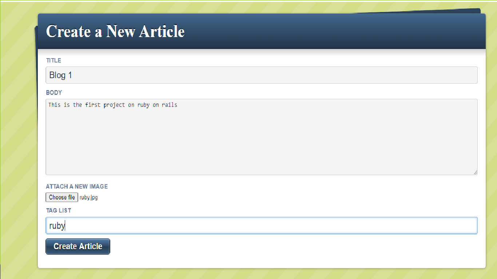
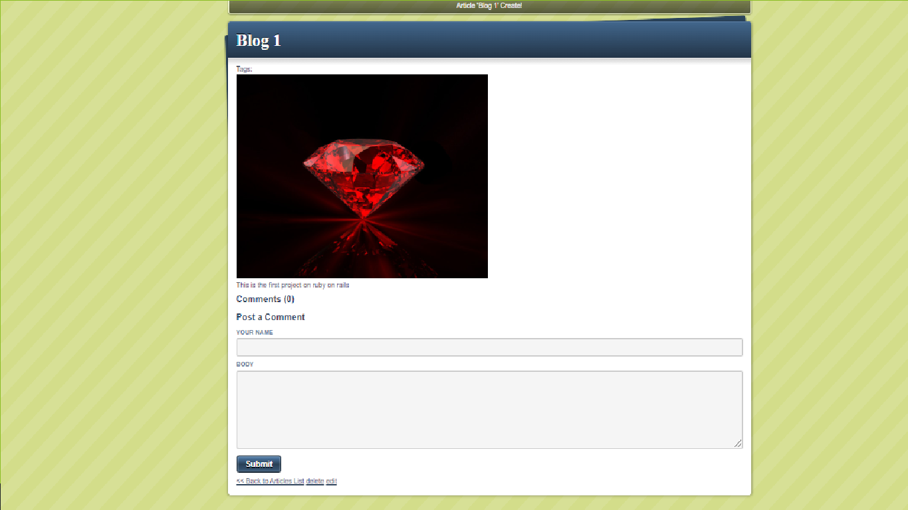
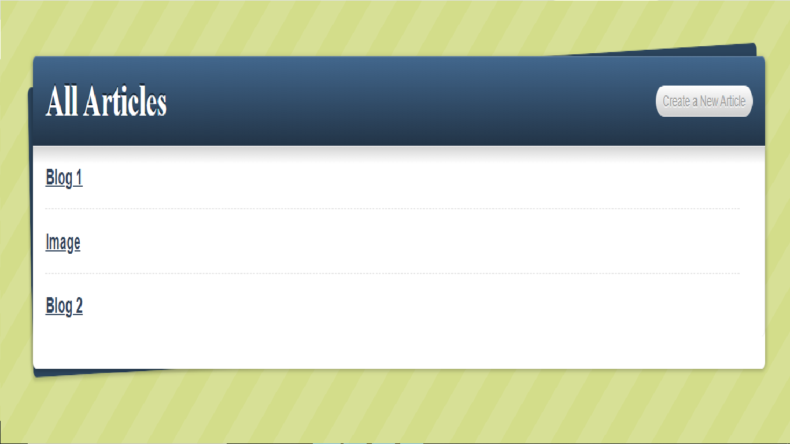

# Blog appp Ruby on Rails

This repository contains the Ruby on rails Blog app, where you can create an article with a title, a body, a tag, and an image, also you can delete it, edit it and add comments.

## Built With :

- [GitHub](https://github.com/)
- [SQL](https://sqlzoo.net/wiki/SQL_Tutorial)
- [Rails](https://rubyonrails.org/)
- [Heroku](https://dashboard.heroku.com/)

## Issue page link

[Issue link](https://github.com/BrianSammit/Rails_blog/issues)

### Usage

- Personal Project - made a blog in ruby on rails to learn how to use rails.
- [project link](https://polar-oasis-70777.herokuapp.com/articles)

## Authors

👤 **Brian Sammit Cruz Rodriguez**

- Github: [@BrianSammit](https://github.com/BrianSammit)
- Twitter: [@CruzSammit](https://twitter.com/CruzSammit)
- Linkedin: [Brian Sammit](https://www.linkedin.com/in/brian-sammit-cruz-rodriguez-5877551a8/)

👤 **Alejandro Toledo**

- GitHub: [@alejandrotoledoweb](https://github.com/alejandrotoledoweb)
- Twitter: [@alejot](https://twitter.com/alejot)
- LinkedIn: [Alejandro Toledo](https://www.linkedin.com/in/alejandro-toledo-3b444b109/)

## 🤝 Contributing

Contributions, issues and feature requests are welcome!
Feel free to check the issues page.

## Show your support ⭐️

Give a ⭐️ if you like this project!

## 📝 License

This project is MIT licensed.
